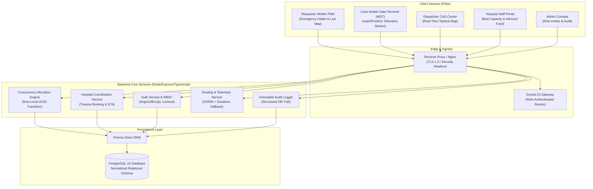
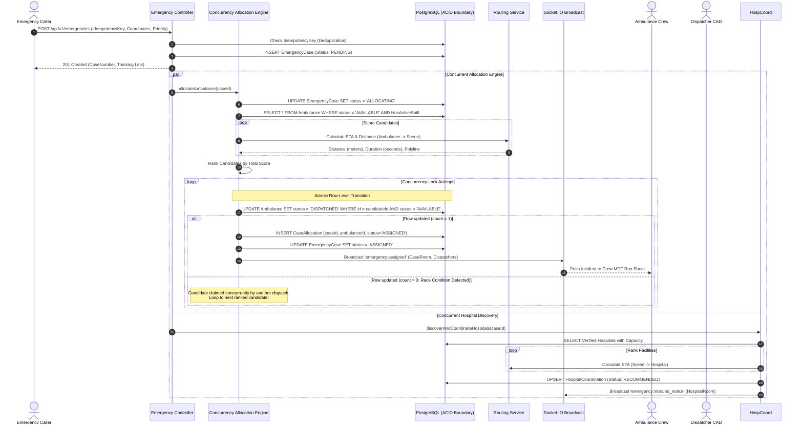
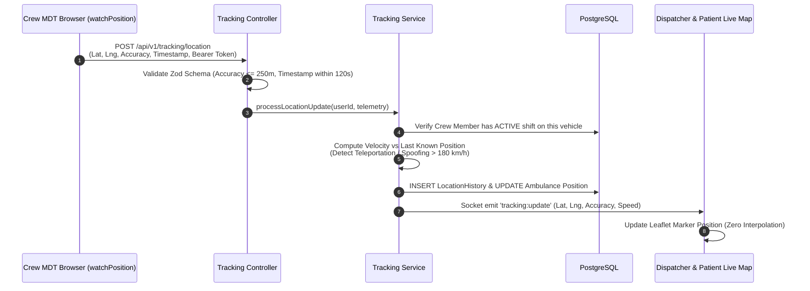

# System Architecture Specification

## 1. High-Level Architecture Overview

```mermaid
graph TD
    subgraph ClientLayer ["Client Devices (PWA)"]
        Requester["Requester Mobile PWA<br/>(Emergency Intake & Live Map)"]
        Crew["Crew Mobile Data Terminal (MDT)<br/>(watchPosition Telemetry Stream)"]
        Dispatcher["Dispatcher CAD Center<br/>(Real-Time Tactical Map)"]
        HospitalStaff["Hospital Staff Portal<br/>(Bed Capacity & Inbound Feed)"]
        Admin["Admin Console<br/>(Role Invites & Audit)"]
    end

    subgraph TransportLayer ["Edge & Ingress"]
        Nginx["Reverse Proxy / Nginx<br/>(TLS 1.3 / Security Headers)"]
        WS["Socket.IO Gateway<br/>(Role-Authenticated Rooms)"]
    end

    subgraph ServiceLayer ["Backend Core Services (Node/Express/TypeScript)"]
        AuthSvc["Auth Service & RBAC<br/>(Argon2/Bcrypt, Lockout)"]
        AllocEngine["Concurrency Allocation Engine<br/>(Row-Level ACID Transition)"]
        HospCoord["Hospital Coordination Service<br/>(Trauma Ranking & ETA)"]
        RoutingSvc["Routing & Telemetry Service<br/>(OSRM + Geodesic Fallback)"]
        AuditSvc["Immutable Audit Logger<br/>(Structured DB Trail)"]
    end

    subgraph DataLayer ["Persistence Layer"]
        Postgres[(PostgreSQL 16 Database<br/>Normalized Relational Schema)]
        PrismaORM[Prisma Client ORM]
    end

    Requester --> Nginx
    Crew --> Nginx
    Dispatcher --> Nginx
    HospitalStaff --> Nginx
    Admin --> Nginx

    Nginx --> WS
    Nginx --> AuthSvc
    Nginx --> AllocEngine
    Nginx --> HospCoord
    Nginx --> RoutingSvc
    Nginx --> AuditSvc

    AllocEngine --> PrismaORM
    HospCoord --> PrismaORM
    AuthSvc --> PrismaORM
    AuditSvc --> PrismaORM
    PrismaORM --> Postgres
```

---

## 2. Concurrency-Safe Atomic Allocation Workflow

```mermaid
sequenceDiagram
    autonumber
    actor Caller as Emergency Caller
    participant API as Emergency Controller
    participant Engine as Concurrency Allocation Engine
    participant DB as PostgreSQL (ACID Boundary)
    participant OSRM as Routing Service
    participant WS as Socket.IO Broadcast
    actor Crew as Ambulance Crew
    actor Disp as Dispatcher CAD

    Caller->>API: POST /api/v1/emergencies (IdempotencyKey, Coordinates, Priority)
    API->>DB: Check IdempotencyKey (Deduplication)
    API->>DB: INSERT EmergencyCase (Status: PENDING)
    API-->>Caller: 201 Created (CaseNumber, Tracking Link)
    
    par Concurrent Allocation Engine
        API->>Engine: allocateAmbulance(caseId)
        Engine->>DB: UPDATE EmergencyCase SET status = 'ALLOCATING'
        Engine->>DB: SELECT * FROM Ambulance WHERE status = 'AVAILABLE' AND HasActiveShift
        loop Score Candidates
            Engine->>OSRM: Calculate ETA & Distance (Ambulance -> Scene)
            OSRM-->>Engine: Distance (meters), Duration (seconds), Polyline
        end
        Engine->>Engine: Rank Candidates by Total Score
        
        loop Concurrency Lock Attempt
            Note over Engine,DB: Atomic Row-Level Transition
            Engine->>DB: UPDATE Ambulance SET status = 'DISPATCHED' WHERE id = candidateId AND status = 'AVAILABLE'
            alt Row updated (count = 1)
                Engine->>DB: INSERT CaseAllocation (caseId, ambulanceId, status='ASSIGNED')
                Engine->>DB: UPDATE EmergencyCase SET status = 'ASSIGNED'
                Engine->>WS: Broadcast 'emergency:assigned' (CaseRoom, Dispatchers)
                WS-->>Crew: Push Incident to Crew MDT Run Sheet
            else Row updated (count = 0: Race Condition Detected)
                Note over Engine: Candidate claimed concurrently by another dispatch.<br/>Loop to next ranked candidate!
            end
        end
    and Concurrent Hospital Discovery
        API->>HospCoord: discoverAndCoordinateHospitals(caseId)
        HospCoord->>DB: SELECT Verified Hospitals with Capacity
        loop Rank Facilities
            HospCoord->>OSRM: Calculate ETA (Scene -> Hospital)
        end
        HospCoord->>DB: UPSERT HospitalCoordination (Status: RECOMMENDED)
        HospCoord->>WS: Broadcast 'emergency:inbound_notice' (HospitalRoom)
    end
```

---

## 3. Real GPS Telemetry and Physics Sanity Sequence

```mermaid
sequenceDiagram
    autonumber
    participant Device as Crew MDT Browser (watchPosition)
    participant TrackingCtrl as Tracking Controller
    participant TrackingSvc as Tracking Service
    participant DB as PostgreSQL
    participant DispatchMap as Dispatcher & Patient Live Map

    Device->>TrackingCtrl: POST /api/v1/tracking/location<br/>(Lat, Lng, Accuracy, Timestamp, Bearer Token)
    TrackingCtrl->>TrackingCtrl: Validate Zod Schema (Accuracy <= 250m, Timestamp within 120s)
    TrackingCtrl->>TrackingSvc: processLocationUpdate(userId, telemetry)
    TrackingSvc->>DB: Verify Crew Member has ACTIVE shift on this vehicle
    TrackingSvc->>TrackingSvc: Compute Velocity vs Last Known Position<br/>(Detect Teleportation / Spoofing > 180 km/h)
    TrackingSvc->>DB: INSERT LocationHistory & UPDATE Ambulance Position
    TrackingSvc->>DispatchMap: Socket emit 'tracking:update' (Lat, Lng, Accuracy, Speed)
    DispatchMap->>DispatchMap: Update Leaflet Marker Position (Zero Interpolation)
```
